# Beyond Chronology: Cross-Modal Neural Retrieval for Microservice Log Disentanglement  and Root Cause Analysis

[](https://www.python.org/downloads/)
[](https://pytorch.org/)
[](https://huggingface.co/)
[](https://opensource.org/licenses/MIT)

**Official Implementation of the Paper:** *Beyond Chronology: Cross-Modal Neural Retrieval for Microservice Log Disentanglement  and Root Cause Analysis*  

## 📖 Overview
In high-concurrency microservice environments, non-deterministic network latencies, buffer flushes, and NTP clock drift physically fragment multi-line application backtraces into asynchronous **"spaghetti logs."** 

This repository contains the **Cross-Modal Neural Retrieval Framework**, an Information Retrieval (IR) pipeline that bypasses corrupted chronological logging structures. By fusing discrete textual semantics (LogBERT) with continuous temporal embeddings (Time2Vec), and applying a Multi-Head Self-Attention (MHSA) graph, this framework unweaves interleaved log streams. The cleanly extracted latent sub-graphs are then passed to a Retrieval-Augmented Generation (RAG) module powered by Qwen2.5 to autonomously generate highly accurate Root Cause Analysis (RCA) diagnostics.

---

## 🏗️ Architecture

```mermaid
graph LR
    classDef inputNode fill:#f8f9fa,stroke:#424242,stroke-width:2px,color:#000;
    classDef processNode fill:#e3f2fd,stroke:#0277bd,stroke-width:2px,color:#000;
    classDef graphNode fill:#ede7f6,stroke:#6a1b9a,stroke-width:2px,color:#000;
    classDef llmNode fill:#e8f5e9,stroke:#2e7d32,stroke-width:2px,color:#000;
    classDef outputNode fill:#fff3e0,stroke:#f57c00,stroke-width:2px,color:#000;

    DB[("$$\begin{array}{c} \text{Interleaved Logs} \\ u_i = \langle x_i, \tilde{t}_i \rangle \end{array}$$")]:::inputNode
    
    subgraph Stage 1: Dense Encoding
        direction TB
        TE["Text Encoder<br/>LogBERT"]:::processNode
        T2V["Time2Vec<br/>Embeddings"]:::processNode
        VEC["$$\begin{array}{c} \text{Cross-Modal Vector} \\ v_i = h_i \oplus t_{emb} \end{array}$$"]:::processNode
    end
    
    subgraph Stage 2: Neural Threading
        ATTN(("$$\begin{array}{c} \text{Self-Attention} \\ \text{Graph } A_{i,j} \end{array}$$")):::graphNode
    end
    
    subgraph Stage 3: Retrieval
        TOPK{"Top-K<br/>Extraction"}:::processNode
        CLEAN["$$\begin{array}{c} \text{Disentangled Sub-graph} \\ \mathcal{R}_{trig} \end{array}$$"]:::processNode
    end
    
    subgraph Stage 4: Generation
        LLM["Generative LLM<br/>Qwen2.5-14B (RAG)"]:::llmNode
    end
    
    OUT[/"$$\begin{array}{c} \text{RCA Diagnosis} \\ P_{RCA} \end{array}$$"/]:::outputNode

    DB -->|"$$x_i$$"| TE
    DB -->|"$$\tilde{t}_i$$"| T2V
    TE -->|"$$h_i$$"| VEC
    T2V -->|"$$t_{emb}$$"| VEC
    VEC -->|"$$V$$"| ATTN
    ATTN -->|"Affinity $$A$$"| TOPK
    TOPK --> CLEAN
    CLEAN -->|Context| LLM
    LLM --> OUT
```


---

## ⚙️ Hardware & System Requirements
The framework is optimized to run locally on enterprise-grade workstation setups:
* **OS:** Ubuntu 22.04 LTS
* **CPU:** Intel® Xeon® Gold 5215 (20 Cores) @ 3.40 GHz
* **GPU:** 1x NVIDIA RTX A5500 (24 GB VRAM)
* **RAM:** 64 GB+ (Recommended for caching large log corpora)
* *Note: The Generative RAG stage utilizes `Qwen/Qwen2.5-14B-Instruct` natively quantized to 4-bit (NF4) via `bitsandbytes`, perfectly fitting within the 24GB VRAM constraint of the RTX A5500 during inference.*

---

## 🚀 Installation & Setup

1. **Clone the Repository**
```bash
git clone https://github.com/YourUsername/Neural-Log-Disentanglement.git
cd Neural-Log-Disentanglement
```

2. **Create a Conda Environment**
```bash
conda create -n log-rca python=3.10 -y
conda activate log-rca
```

3. **Install Dependencies**
```bash
# Install PyTorch bound to CUDA 11.8 (Adjust based on your driver)
pip install torch torchvision torchaudio --index-url https://download.pytorch.org/whl/cu118

# Install Framework & LLM Requirements
pip install transformers accelerate bitsandbytes sentence-transformers rank_bm25 scikit-learn pandas numpy networkx tqdm
```
---
## 📁 Directory Structure

The repository is organized as follows to separate raw data, model training, and inference pipelines cleanly:

```text
Neural-Log-Disentanglement/
├── data/
│   ├── raw/                  # Place the original RCAEval RE3 dataset here
│   ├── processed/            # Generated interleaved corpus and Golden Key
│   └── results/              # Outputs: extracted sub-graphs and generated RCA reports
├── src/
│   ├── data/
│   │   └── build_interleaved_corpus.py  # Injects NTP jitter and fractures traces (Algorithm 1)
│   ├── models/
│   │   └── train_threading.py           # Trains the Cross-Modal MHSA Bi-Encoder
│   ├── inference/
│   │   ├── retrieve.py                  # Executes Top-K semantic sub-graph extraction
│   │   └── generate_rca.py              # Runs the local Qwen-14B RAG diagnosis
│   └── evaluation/
│       ├── run_benchmarks.py            # Computes IR metrics (Recall@K, MRR, AC@K)
│       └── generate_paper_graphs.py     # Generates IEEE/ACM PDF plots for the paper
├── run_overnight.sh          # Master batch script for executing the full parameter sweep
├── get_paper_result.sh       # Extractor script for parsing tables from the overnight log
├── checkpoints/              # Stores trained model weights (e.g., mhsa_best.pt)
└── README.md                 # Project documentation
```
---

## 📂 Step-by-Step Implementation Guide

### Step 1: Dataset Construction (Simulating Jitter & Fragmentation)
We use the **RE3 dataset from RCAEval**. Before training, we must computationally fracture the contiguous trace blocks, inject NTP clock jitter, and simulate retry storms.

1. Download the raw RCAEval RE3 dataset and place it in `data/raw/`.
2. Run the dataset construction script:
```bash
python src/data/build_interleaved_corpus.py --clock_drift_variance 50.0 --gumbel_scale 15.0
```

### Step 2: Training the Neural Threading Graph (MHSA)
Train the Cross-Modal Bi-Encoder and the Self-Attention projection matrices ($\mathbf{W}_Q$, $\mathbf{W}_K$) using Contrastive Margin Loss.

```bash
python src/models/train_threading.py --epochs 30 --batch_size 32 --learning_rate 2e-5
```

### Step 3: Dense Sub-Graph Retrieval (Inference)
Run the inference script to evaluate the Top-K subgraph extraction. This simulates an anomaly trigger and attempts to retrieve the uncorrupted stack trace.

```bash
python src/inference/retrieve.py --top_k 25 --window_size 2500
```

### Step 4: Generative Diagnosis (LLM RAG Pipeline)
Feed the cleanly extracted sub-graph to the local Qwen-14B LLM to generate the final diagnostic root cause.

```bash
python src/inference/generate_rca.py --model_name "Qwen/Qwen2.5-14B-Instruct"
```

---

## 📊 Full Paper Evaluation (Reproducing Tables & Graphs)

To reproduce the exact metrics found in **Table 1**, **Table 2**, and **Figure 1** of the paper, we provide a unified batch script that sweeps through Top-K thresholds and NTP Jitter variances.

**1. Run the Overnight Evaluation Batch:**
```bash
nohup ./run_overnight.sh > data/results/system_output.log 2>&1 &
```

**2. Extract the Final Paper Tables:**
Once the run is complete, extract the clean LaTeX table metrics:
```bash
./get_paper_result.sh
```

**3. Generate the Graphs in PDF format:**
Copy the arrays printed by the extraction script into `src/evaluation/generate_paper_graphs.py`, then run:
```bash
python src/evaluation/generate_paper_graphs.py
```
This will output `fig_a_subgraph_limit.pdf` and `fig_b_temporal_robustness.pdf` directly into the `data/results/graphs/` folder.

---
```