# Beyond Chronology: Cross-Modal Neural Retrieval for Microservice Log Disentanglement

[](https://www.python.org/downloads/)
[](https://pytorch.org/)
[](https://github.com/vllm-project/vllm)
[](https://opensource.org/licenses/MIT)

**Official Implementation of the Paper:** *Beyond Chronology: Cross-Modal Neural Retrieval for Microservice Log Disentanglement*  

## 📖 Overview
In high-concurrency microservice environments, non-deterministic network latencies, buffer flushes, and NTP clock drift physically fragment multi-line application backtraces into asynchronous **"spaghetti logs."** 

This repository contains the **Cross-Modal Neural Retrieval Framework**, an Information Retrieval (IR) pipeline that bypasses corrupted chronological logging structures. By fusing discrete textual semantics (LogBERT) with continuous temporal embeddings (Time2Vec), and applying a Multi-Head Self-Attention (MHSA) graph, this framework unweaves interleaved log streams. The cleanly extracted latent sub-graphs are then passed to a Retrieval-Augmented Generation (RAG) module powered by Llama-3 to autonomously generate highly accurate Root Cause Analysis (RCA) diagnostics.

---

## 🏗️ Architecture

```mermaid
graph LR
    classDef inputNode fill:#f8f9fa,stroke:#424242,stroke-width:2px,color:#000;
    classDef processNode fill:#e3f2fd,stroke:#0277bd,stroke-width:2px,color:#000;
    classDef graphNode fill:#ede7f6,stroke:#6a1b9a,stroke-width:2px,color:#000;
    classDef llmNode fill:#e8f5e9,stroke:#2e7d32,stroke-width:2px,color:#000;
    classDef outputNode fill:#fff3e0,stroke:#f57c00,stroke-width:2px,color:#000;

    DB[("$$\begin{array}{c} \text{Interleaved Logs} \\ u_i = \langle x_i, \tilde{t}_i \rangle \end{array}$$")]:::inputNode
    
    subgraph Stage 1: Dense Encoding
        direction TB
        TE["Text Encoder<br/>LogBERT"]:::processNode
        T2V["Time2Vec<br/>Embeddings"]:::processNode
        VEC["$$\begin{array}{c} \text{Cross-Modal Vector} \\ v_i = h_i \oplus t_{emb} \end{array}$$"]:::processNode
    end
    
    subgraph Stage 2: Neural Threading
        ATTN(("$$\begin{array}{c} \text{Self-Attention} \\ \text{Graph } A_{i,j} \end{array}$$")):::graphNode
    end
    
    subgraph Stage 3: Retrieval
        TOPK{"Top-K<br/>Extraction"}:::processNode
        CLEAN["$$\begin{array}{c} \text{Disentangled Sub-graph} \\ \mathcal{R}_{trig} \end{array}$$"]:::processNode
    end
    
    subgraph Stage 4: Generation
        LLM["Generative LLM<br/>Llama-3 (RAG)"]:::llmNode
    end
    
    OUT[/"$$\begin{array}{c} \text{RCA Diagnosis} \\ P_{RCA} \end{array}$$"/]:::outputNode

    DB -->|"$$x_i$$"| TE
    DB -->|"$$\tilde{t}_i$$"| T2V
    TE -->|"$$h_i$$"| VEC
    T2V -->|"$$t_{emb}$$"| VEC
    VEC -->|"$$V$$"| ATTN
    ATTN -->|"Affinity $$A$$"| TOPK
    TOPK --> CLEAN
    CLEAN -->|Context| LLM
    LLM --> OUT
```


*(Diagram renders in GitHub natively using Mermaid.js)*

---

## ⚙️ Hardware & System Requirements
The framework is optimized to run locally on enterprise-grade workstation setups:
* **OS:** Ubuntu 22.04 LTS
* **CPU:** Intel® Xeon® Gold 5215 (20 Cores) @ 3.40 GHz
* **GPU:** 1x NVIDIA RTX A5500 (24 GB VRAM)
* **RAM:** 64 GB+ (Recommended for caching large log corpora)
* *Note: The Generative RAG stage utilizes `Meta-Llama-3-8B-Instruct` quantized to 4-bit, perfectly fitting within the 24GB VRAM constraint of the RTX A5500 during inference.*

---

## 🚀 Installation & Setup

1. **Clone the Repository**
```bash
git clone https://github.com/YourUsername/Neural-Log-Disentanglement.git
cd CrossModal-Log-Retrieval
```

2. **Create a Conda Environment**
```bash
conda create -n log-rca python=3.10 -y
conda activate log-rca
```

3. **Install Dependencies**
```bash
pip install torch torchvision torchaudio --index-url https://download.pytorch.org/whl/cu118
pip install transformers vllm scikit-learn pandas numpy networkx
pip install -r requirements.txt
```

---

## 📂 Step-by-Step Implementation Guide

### Step 1: Dataset Construction (Simulating Jitter & Fragmentation)
We use the **RE3 dataset from RCAEval**. Before training, we must computationally fracture the contiguous trace blocks and inject NTP clock jitter.

1. Download the raw RCAEval RE3 dataset and place it in `/data/raw/`.
2. Run the dataset construction script to inject temporal perturbations (Algorithm 1):
```bash
python src/data/build_interleaved_corpus.py \
    --input_dir data/raw/ \
    --output_dir data/processed/ \
    --clock_drift_variance 5.0 \
    --gumbel_delay_scale 2.0
```
*Outputs:* `universal_corpus.csv` (The interleaved logs) and `golden_key.json` (Ground truth associations).

### Step 2: Training the Neural Threading Graph (MHSA)
Train the Cross-Modal Bi-Encoder and the Self-Attention projection matrices ($\mathbf{W}_Q$, $\mathbf{W}_K$) using Contrastive Margin Loss.

```bash
python src/models/train_threading.py \
    --corpus data/processed/universal_corpus.csv \
    --golden_key data/processed/golden_key.json \
    --epochs 10 \
    --batch_size 256 \
    --margin_alpha 0.5 \
    --learning_rate 2e-5
```
*Outputs:* Saves the trained attention weights to `/checkpoints/mhsa_best.pt`.

### Step 3: Dense Sub-Graph Retrieval (Inference)
Run the inference script to evaluate the Top-K subgraph extraction. This simulates an anomaly trigger and attempts to retrieve the uncorrupted stack trace.

```bash
python src/inference/retrieve.py \
    --checkpoint checkpoints/mhsa_best.pt \
    --trigger_index 10452 \
    --top_k 25 \
    --output_context data/results/retrieved_context.txt
```
*Outputs:* The disentangled sequence $\mathcal{R}_{trig}$ stored as raw text, evaluated internally via Recall@K and MRR.

### Step 4: Generative Diagnosis (LLM RAG Pipeline)
Feed the cleanly extracted sub-graph to the local Llama-3 LLM via `vLLM` to generate the final diagnostic root cause.

```bash
# Ensure huggingface-cli login is complete for Llama-3 access
python src/inference/generate_rca.py \
    --context_file data/results/retrieved_context.txt \
    --model_path "meta-llama/Meta-Llama-3-8B-Instruct" \
    --quantization "awq" \
    --temperature 0.0
```
*Outputs:* Prints the generated RCA report to the console and logs the Accuracy@K scores.

---

## 📊 Evaluation
To run the full evaluation suite and reproduce the tables found in the paper (Table 1 & Table 2):
```bash
python src/evaluation/run_benchmarks.py --all
```
This will automatically evaluate **BM25**, **DPR**, and our **Cross-Modal Framework** across the test split, calculating `Recall@5`, `Recall@15`, `MRR`, `AC@1`, and `AC@3`.

---
